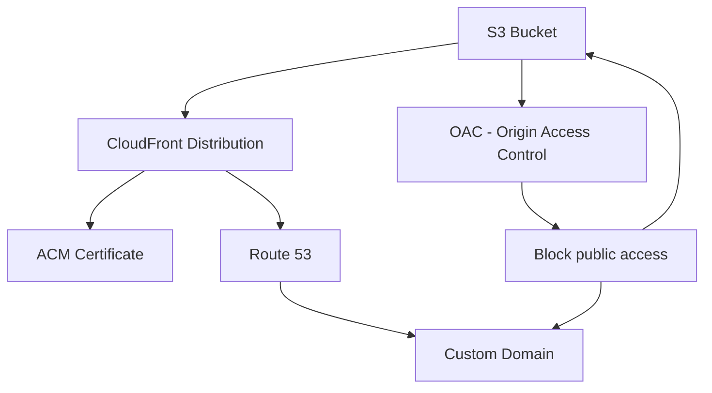

# AWS Secure Static Website with Terraform

This project deploys a secure, highly available static website on AWS using **S3**, **CloudFront**, **Route 53**, and **ACM** — fully provisioned with **Terraform**.

---

## ✨ Features

- ✅ Host a static website using Amazon **S3**
- ✅ Secure it with **CloudFront CDN**
- ✅ Use **SSL/TLS** certificates from **AWS Certificate Manager**
- ✅ Attach a custom domain with **Route 53**
- ✅ Prevent public access to S3 via **OAC** (Origin Access Control)
- ✅ Use Terraform for **Infrastructure as Code**

---

## Architecture

- **S3**: Hosts the static assets such as HTML, CSS, and JS files.
- **CloudFront**: Provides a global CDN for faster delivery and secures the site with HTTPS
- **ACM**:  Manages the SSL certificate for secure HTTPS connections.
- **Route 53**: Manages the DNS records for the custom domain.
- **OAC**: Origin Access Control ensures that S3 content is only accessible via CloudFront, preventing direct access to the S3 bucket.
---

## 📁 Project Structure

```bash
.
├── main.tf                      # Core resources (S3, CloudFront, etc.)
├── s3-website/
│   └── index.html               # Static site content
├── variables.tf                 # Input variables
├── outputs.tf                  # Outputs like website URL
└── terraform.tfvars            # Variable values
```


# Setup Steps
- Clone the repo and navigate to the project directory:
```git clone https://github.com/username/secure-static-site-terraform.git```

```cd secure-static-site-terraform```
- Initialize Terraform:
```terraform init```
- Review the Terraform configuration:
Open the `main.tf` and `cloudfront.tf` files to review the configuration. You can adjust any settings such as bucket names, region, or resources as needed.
-  Run Terraform plan:
Generate an execution plan to review the changes Terraform will make to your infrastructure.
```terraform plan```
-  Apply the changes:
Apply the changes to create the AWS resources.
```terraform apply```
- Access your static site:
Once the `terraform apply` completes, Terraform will output the CloudFront URL where your static site is hosted. You can access it using this URL.

## Files
- `main.tf`: Contains the S3 bucket configuration and website deployment.
- `cloudfront.tf`: Contains the CloudFront distribution setup.
- `variables.tf`: Contains variables for S3 bucket name, region, etc.
- `outputs.tf`: Displays the URL of the CloudFront distribution.

### Issues Faced & How We Solved Them
- **Issue**: Bucket name conflict
  
- Cause: S3 bucket names are globally unique.
  
- Solution: Appended a random_id to ensure uniqueness:
`bucket = "moe-static-site-${random_id.bucket_id.hex}"`

- **Issue**: Access Denied on CloudFront
  
- Cause: S3 bucket was private, and CloudFront didn't have permission.
  
- Solution: Used `aws_cloudfront_origin_access_control` (OAC) and attached it to CloudFront.

- **Issue**: HTTPS certificate not recognized
  
- Cause: Certificate was not in us-east-1, which CloudFront requires.

- Solution: Created ACM certificate in us-east-1 and referenced it in CloudFront.

### Output
After successful deployment, Terraform will output:
- Static website URL (CloudFront distribution)
- Bucket name
- Hosted zone ID (if Route 53 is included)

### Contributing
Pull requests are welcome. For major changes, please open an issue first to discuss what you would like to change.

### Future Improvements

- Add CI/CD deployment via GitHub Actions
- Enable logging for CloudFront and S3
- Add error page (e.g., 404.html)


# Resources
- Terraform Documentation
- AWS S3 Documentation
- AWS CloudFront Documentation

# License
This project is licensed under the MIT License - see the LICENSE file for details.
